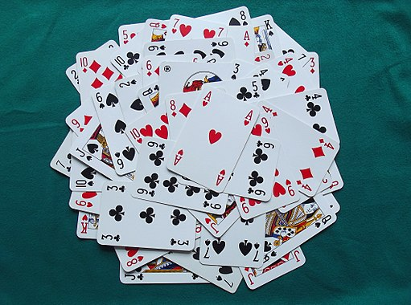
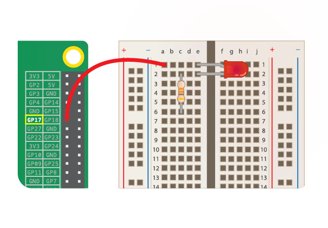

## Introduction

Create a model of a deck of cards that can form the basis for building digital card game programs such as Poker or Gin Rummy.

### What you will make

You will learn how to use the object-oriented programming paradigm in Python to create a reusable model of a deck of cards.

Object-oriented programming (OOP) is a way of organising your code so it is easier to understand, reuse, and change. OOP allows you to combine data (variables) and functionality and wrap them together inside **objects**.



_Image by Rosapicci (Own work) [CC BY-SA 4.0](https://creativecommons.org/licenses/by-sa/4.0), via Wikimedia Commons_

--- collapse ---

---
title: What is object-oriented programming?
---

You have probably heard of object-oriented programming, but perhaps you are unsure about what it is. Maybe you have even attempted to read guides or books but got lost in the jargon. 

Object-oriented programming is integral to many programming languages and it is simply a different style of programming. 

#### What is an object?

Objects are used to model things in code. An object can represent a physical item, such as an LED, or it can represent a digital unit, such as a bank account or a character in a computer game. An object is basically a group of data and functions. Because you can define your own objects, you can represent anything you like with an object!

#### Where would I have seen objects before?

Let’s look at an example of an LED wired up to a Raspberry Pi computer. Don’t worry if you have never wired up an LED or done other physical computing — the important thing here is the code!



On the left of the diagram are the Raspberry Pi’s GPIO pins, which allow us to control components that are connected to them. The LED is connected to pin 17. To make the LED switch on, you would use the following Python code:

```python
from gpiozero import LED
red = LED(17)			
red.on()
```

To interact with the LED, we have created an `LED` object which represents the physical LED in code. It has the name `red` so that we can refer to that specific LED object.

```python
red = LED(17)
```

We can wire up another LED to pin 21, and then create another object with a different name to represent it:

```python
green = LED(21)
```

#### Why would I want to use objects?

In our example, we created an `LED` object to model a physical LED in code. We also included a command to control the LED, in this case to turn it `on`. Such commands are called methods — custom functions specifically designed to interact with an object.

One of the benefits of using object-oriented programming is that unnecessary details can be left out when we use a method. We do not need to know the specifics of exactly how a method works to be able to use it, we can just call it to achieve a desired outcome. In our example, we don’t need to know anything about the `on()` method apart from the fact that using it on our `LED` object will make the physical LED light up.

--- /collapse ---

### What you will learn

This project covers elements from the following strands of the [Raspberry Pi Digital Making Curriculum](http://rpf.io/curriculum){:target="_blank"}:

+ [Apply higher-order programming techniques to solve real-world problems](https://curriculum.raspberrypi.org/programming/maker/){:target="_blank"}

### Additional information for educators

If you need to print this project, please use the [printer-friendly version](https://projects.raspberrypi.org/en/projects/deck-of-cards/print){:target="_blank"}.

Use the link in the footer to access the GitHub repository for this project, which contains all resources (including an example finished project) in the 'en/resources' folder.
