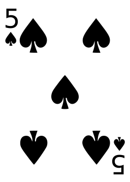

## Create a class

A **class** is like a template for creating objects. Think of a class as being similar to a cookie cutter — it is a template for all the cookie objects you make. You can make as many instances of cookie objects as you want, and they will all start off from the same template. 

<video width="768" height="576" controls>
<source src="resources/Cementyourknowledgeofobjects_sd.mp4" type="video/mp4">
Your browser does not support the video tag, so try FireFox or Chrome.
</video>

When you make real cookies, you make them with the same cookie cutter, but you can customise each individual cookie, for example by adding some icing or some sprinkles. It's the same with objects created using a class — you can costumise each object by storing different data in it. Let's look at how this works in practice.

### Create a class

You are going to begin by making a `Card` class that will act as a template for creating playing card objects.

Each card object is a separate **instance** of the `Card` class. For example, you might have a card object representing the 5 of Spades and another card object representing the 2 of Hearts.

Our playing cards will be represented as text rather than pictures like the one below.



You can choose whether to watch the video or to use the written instructions.

<video width="768" height="576" controls>
<source src="resources/clip1.mp4" type="video/mp4">
Your browser does not support the video tag, so try FireFox or Chrome.
</video>

--- task ---

Open a new Python file and save it as `card.py`.

--- /task ---

--- task ---

Begin by creating a `Card` class:

```python
class Card:
```

Class names are usually written with a capital letter so that they are easily distinguishable from variable names.

Next, you are going to add a **method** to the class. Methods are very similar to functions, and we use them to interact with objects.

### Methods

You may have already encountered functions when writing Python code. Functions allow us to give a name to a set of instructions. You can pass data to a function as parameters, and optionally you can have it return some data as a result.

The difference between a function and a method is that the method is called **on an object**. This means that a method can use all of the data stored inside the object, as well as any data that you pass to it as parameters.

### Create an `__init__` method

In Python, every class has a special method called `__init__` that tells it how to create (or **initialise**) an object. This particular method name always has a double underscore on either side of `init`.

--- /task ---

--- task ---

Create an `__init__` method inside your `Card` class:

```python
class Card:
 def __init__(self):
```

--- collapse ---
---
title: Why do I need the `self` in the brackets?
---
A method needs context in order to work. `self` is the reference to the object, and it needs to be the first parameter passed to any `Class` method. This is because the method needs to know what it is being called on, so that it can use the data stored within the object.

Let's look at an example:

Outside of OOP, for two functions to share the same variable, it must be global:

```python
name = "Laura"

def hi():
 print("Hi " + name)

def bye():
 print("Bye " + name)
```

Within a class, `self` can be used to share variables.

```python
class Welcome():
 def __init__(self):
 self.name = "Laura"

 def hi(self):
 print("Hi " + self.name)

 def bye(self):
 print("Bye " + self.name)
```

Here, we defined the variable `self.name` and set its value to `"Laura"` within the `__init__` method that initialises object of this class. Thus all objects will contain a variable `self.name` set to `"Laura"`. The `hi()` and `bye()` methods we defined can now use the information stored in `self.name`.

--- /collapse ---

### Attributes

Attributes are pieces of information stored within an object, rather like a collection of variables associated with that object. The card object will begin with two attributes, `suit` and `number`, and we will prefix them with `self.` to show that they belong to the object instance.

--- /task ---

--- task ---

Add two attributes to your `__init__` method, and two parameters so that you can pass in their values as arguments when you create the object:

```python
def __init__(self, suit, number):
 self.suit = suit
 self.number = number
```

--- /task ---
