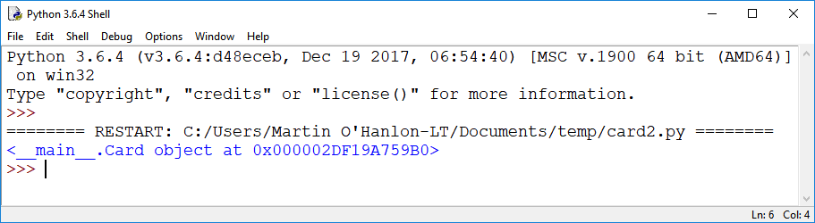
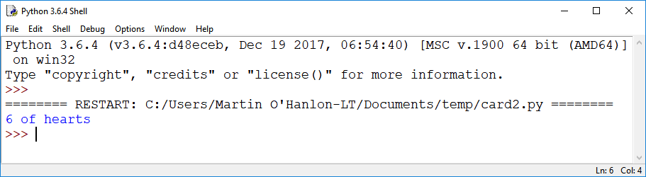

## Instantiate an object

<video width="768" height="576" controls>
<source src="resources/clip2.mp4" type="video/mp4">
Your browser does not support the video tag, so try FireFox or Chrome.
</video>

Let's test out our `Card` class by creating a card object. The object is an **instance** of the `Card` class, and creating it is also called **instantiating**.

--- task ---

Below your class definition, instantiate a card object called `my_card` for the 6 of Hearts:

```python
my_card = Card("hearts", "6")
```

You may be wondering why the card number is `"6"` (a string) and not `6` (an integer). This is because some of the card "numbers" will be letters: `"J"`, `"Q"`, `"K"`, and `"A"`.

--- /task ---

--- task ---

Add a print statement to display the card object.

```python
print(my_card)
```

--- /task ---

--- task ---

Run the program. 

You're probably expecting to see an output containing `"hearts"` and `"6"`. What you will see instead is the text **representation** of your object — it is a `Card` object, and you are shown its address in your computer's memory:



This output is created by a special method called `__repr__` (which is short for 'representation'). All objects in Python have this method by default, meaning you do not need to create `__repr__` yourself. It will automatically be used whenever you tell your program to return a text representation of an object. However, you can **override** the default output of the `__repr__` method to change how your object is represented as text.

--- /task ---

--- task ---

Go back to your `Card` class definition and add in some code to override the `__repr__` method so that it describes the card in a more meaningful way:

```python
def __repr__(self):
 return self.number + " of " + self.suit
```

For example, if `self.number` is `"5"` and `self.suit` is `"spades"`, this will print "5 of spades".

--- /task ---

--- task ---

Run the program again and check that your new way of representing the object as text works, e.g.



You can also customise this representation to your own liking.

--- /task ---

