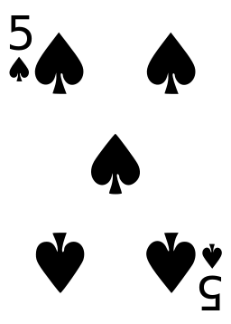

## Crea una clase

Una **clase** es como una plantilla para crear objetos. Imagina que una clase es como un cortador de galletas — es una plantilla para todos los objetos galleta que hagas. Puedes crear tantas instancias de objetos galleta como desees, y todos comenzarán de la misma plantilla. 

<video width="768" height="576" controls>
<source src="resources/Cementyourknowledgeofobjects_sd.mp4" type="video/mp4">
Tu navegador no soporta la etiqueta de vídeo, prueba FireFox o Chrome.
</video>

Cuando haces galletas reales, las haces con el mismo cortador de galletas, pero puedes personalizar cada galleta individualmente, por ejemplo, agregando un poco de glaseado o algunas chispas. Es lo mismo con los objetos creados utilizando una clase — puedes personalizar cada objeto almacenando diferentes datos en él. Veamos cómo funciona esto en la práctica.

### Crea una clase

Vas a comenzar creando una clase `Carta` que actuará como una plantilla para crear objetos de cartas de juego.

Cada objeto carta es una **instancia** diferente de la clase `Carta`. Por ejemplo, puedes tener un objeto carta que represente el 5 de Espadas y otro objeto carta que represente el 2 de Corazones.

Nuestras cartas de juego serán representadas como texto en lugar de imágenes como la de abajo.



Puedes elegir si quieres ver el vídeo o usar las instrucciones escritas.

<video width="768" height="576" controls>
<source src="resources/clip1.mp4" type="video/mp4">
Tu navegador no soporta la etiqueta de vídeo, prueba FireFox o Chrome.
</video>

+ Abre un nuevo archivo de Python y guárdalo como `card.py`.

+ Comienza creando una clase `Carta`:

```python
class Carta:
```

Los nombres de clase generalmente se escriben con una letra mayúscula para que se puedan distinguir fácilmente de los nombres de las variables.

A continuación, vas a añadir un **método** a la clase. Los métodos son muy similares a las funciones, y las utilizamos para interactuar con objetos.

### Métodos

Es posible que ya te hayas encontrado con funciones al escribir código Python. Las funciones nos permiten darle un nombre a un conjunto de instrucciones. Puedes pasar datos a una función como parámetros y, opcionalmente, puedes hacer que devuelva algunos datos como resultado.

La diferencia entre una función y un método es que el método es llamado **en un objeto**. Esto significa que un método puede utilizar todos los datos almacenados dentro del objeto, así como cualquier dato que le pases como parámetro.

### Crea un método `__init__`

En Python, cada clase tiene un método especial llamado `__init__` que le indica cómo crear (o **inicializar**) un objeto. Este nombre de método en particular siempre tiene un guión bajo doble a cada lado de `init`.

+ Crea un método `__init__` dentro de tu clase `Carta`:

```python
class Carta:
    def __init__(self):
```

--- collapse ---
---
title: ¿Por qué necesito el `self` entre los paréntesis?
---

Un método necesita contexto para funcionar. `self` es la referencia al objeto, y debe ser el primer parámetro pasado a cualquier método de `Clase`. Esto se debe a que el método necesita saber a qué se le está llamando, para que pueda utilizar los datos almacenados dentro del objeto.

Veamos un ejemplo:

Fuera de POO, para que dos funciones compartan la misma variable, ésta debe ser global:

```python
nombre = "Laura"

def hola():
    print("Hola " + nombre)

def adios():
    print("Adiós" + nombre)
```

Dentro de una clase, se puede usar `self` para compartir variables.

```python
class Bienvenida():
    def __init__(self):
        self.nombre = "Laura"

    def hola(self):
        print("Hola " + self.nombre)

    def adios(self):
        print("Adiós " + self.nombre)
```

Aquí, definimos la variable `self.nombre` y establecimos su valor a `"Laura"` dentro del método `__init__` que inicializa el objeto de esta clase. Por lo tanto, todos los objetos contendrán una variable `self.nombre` establecida como `"Laura"`. Los métodos `hola()` y `adios()` que definimos ahora pueden utilizar la información almacenada en `self.nombre`.

--- /collapse ---

### Atributos

Los atributos son piezas de información almacenadas dentro de un objeto, más bien como una colección de variables asociadas a ese objeto. El objeto carta comenzará con dos atributos, `palo` y `número`, y los pondremos con el prefijo `self.` para mostrar que pertenecen a la instancia del objeto.

+ Añade dos atributos a tu método `__init__`, y dos parámetros, para que puedas pasar sus valores como argumentos cuando crees el objeto:

```python
def __init__(self, palo, numero):
    self.palo = palo
    self.numero = numero
```
