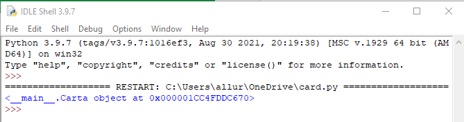

## Instancia un objeto

<video width="768" height="576" controls>
<source src="resources/clip2.mp4" type="video/mp4">
Tu navegador no soporta la etiqueta de vídeo, prueba FireFox o Chrome.
</video>

Vamos a probar nuestra clase `Carta` creando un objeto tarjeta. El objeto es una **instancia** de la clase `Carta`, y crearlo también se denomina **instanciar**.

+ Debajo de la definición de tu clase, instancia un objeto carta llamado `mi_carta` para el 6 de corazones:

```python
mi_carta= Carta("corazones", "6")
```

Puede que te preguntes por qué el número de carta es `"6"` (una cadena) y no `6` (un entero). Esto se debe a que algunos de los "números" de la carta serán letras: `"J"`, `"Q"`, `"K"`, y `"A"`.

+ Añade una instrucción de impresión para mostrar el objeto carta.

```python
print(mi_carta)
```

+ Ejecuta el programa.

Probablemente estás esperando ver un resultado que contenga `"corazones"` y `"6"`. Lo que verás en su lugar es el texto **representación** de tu objeto: es un objeto `Carta`, y se muestra su dirección en la memoria de tu computadora:



Esta salida es creada por un método especial llamado `__repr__` (que es la abreviatura para 'representación'). Todos los objetos en Python tienen este método por defecto, lo que significa que no necesitas crear `__repr__` tú mismo. Se utilizará automáticamente cuando le indiques a tu programa que devuelva una representación de texto de un objeto. Sin embargo, puedes **anular** la salida predeterminada del método `__repr__` para cambiar la forma en que tu objeto se representa como texto.

+ Vuelve a la definición de clase `Carta` y añade algo de código para sobrescribir el método `__repr__`, para que así describa la carta de una manera más significativa:

```python
def __repr__(self):
    return self.numero + " de " + self.palo
```

Por ejemplo, si `self.numero` es `"5"` y `self.palo` es `"espadas"`, esto mostrará "5 de espadas".

+ Ejecuta el programa de nuevo y comprueba que la nueva forma de representar el objeto como texto funciona, por ejemplo


También puedes personalizar esta representación a tu gusto.

