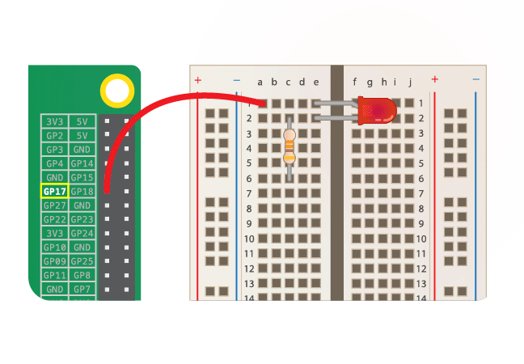

## परिचय

ताश के पत्तों की गड्डी का एक नमूना बनाएं जो पोकर या जिन रम्मी जैसे डिजिटल कार्ड खेल कार्यक्रमों के निर्माण का आधार बन सकता है।

### आप क्या बनाएँगे

आप सीखेंगे कि ताश के पत्तों की गड्डी के पुन: उपयोग करने योग्य मॉडल(model) बनाने के लिए Python में ऑब्जेक्ट-ओरिएंटेड प्रोग्रामिंग(OOP) को मिसाल के रूप में उपयोग कैसे करे

ऑब्जेक्ट-ओरिएंटेड प्रोग्रामिंग (OOP) आपके कोड को व्यवस्थित करने का एक तरीका है, इसलिए इसे समझना, पुन: उपयोग करना और बदलना आसान है। OOP आपको डेटा (वेरिएबल) और कार्यक्षमता(functionality) को इकट्ठा करने और उन्हें **ऑब्जेक्ट्स(objects)** के अंदर एक साथ सम्मिलित करने की अनुमति देता है ।


_रोसैपिसी(Rosapicci)(स्वयं का काम) द्वारा चित्र [CC BY-SA 4.0](https://creativecommons.org/licenses/by-sa/4.0) विकिमीडिया कॉमन्स के माध्यम से_

--- collapse ---
---
title: ऑब्जेक्ट-ओरिएंटेड प्रोग्रामिंग क्या है?
---

आपने शायद ऑब्जेक्ट-ओरिएंटेड प्रोग्रामिंग (object-oriented programming) के बारे में सुना है, लेकिन शायद आप इस बारे में अनिश्चित हैं कि यह क्या है। हो सकता है कि आपने गाइड या किताबें पढ़ने की भी कोशिश की हो, लेकिन शब्दजाल में खो गए।

ऑब्जेक्ट-ओरिएंटेड प्रोग्रामिंग कई प्रोग्रामिंग(programing) भाषाओं का अभिन्न अंग है और यह बस प्रोग्रामिंग(programing) की एक अलग शैली है।

#### ऑब्जेक्ट(object) क्या है?

ऑब्जेक्ट्स(Objects) का उपयोग कोड में चीजों को मॉडल(model) करने के लिए किया जाता है। एक ऑब्जेक्ट(object) एक LED जैसे भौतिक वस्तु का प्रतिनिधित्व कर सकती है, या यह एक डिजिटल इकाई का प्रतिनिधित्व कर सकती है, जैसे कि बैंक खाता या कंप्यूटर गेम में एक अक्षर। एक ऑब्जेक्ट(object) मूल रूप से डेटा(data) और फ़ंक्शन(function) का एक समूह है। क्योंकि आप अपने खुद के ऑब्जेक्ट्स(objects) को परिभाषित कर सकते हैं, आप किसी ऑब्जेक्ट(object) के साथ अपनी पसंद का प्रतिनिधित्व कर सकते हैं!

#### मैंने पहले कहाँ ऑब्जेक्ट(object) को देखा होगा?

आइए एक LED के उदाहरण को देखें जो की Raspberry Pi कंप्यूटर पर लगी हुई(वायर्ड है)। चिंता मत करो अगर आपने कभी LED या अन्य भौतिक कंप्यूटिंग नहीं किया है - यहां महत्वपूर्ण बात कोड है!



चित्र के बाईं ओर Raspberry Pi के GPIO पिन हैं, जो हमें उन पुर्जों को नियंत्रित करने की अनुमति देते हैं जो उनसे जुड़े हैं। LED पिन 17 से जुड़ा है। LED स्विच चालू करने के लिए, आप निम्नलिखित Python कोड का उपयोग करेंगे:

```python
from gpiozero import LED
red = LED(17)           
red.on()
```

LED के साथ सहभागिता करने के लिए, हमने एक `LED` ऑब्जेक्ट(object) बनाई है जो कोड में भौतिक LED का प्रतिनिधित्व करता है। इसका नाम `लाल` है ताकि हम उस विशिष्ट LED ऑब्जेक्ट(object) का उल्लेख कर सकें।

```python
red = LED(17)
```

हम एक दूसरी LED को पिन 21 से लगा सकते है, और फिर इसे प्रदर्शित करने के लिए एक अलग नाम के साथ एक और ऑब्जेक्ट(object) बना सकते हैं:

```python
green = LED(21)
```

#### मैं ऑब्जेक्ट का उपयोग क्यों करना चाहूंगा?

हमारे उदाहरण में, हमने कोड में एक `LED` ऑब्जेक्ट को एक भौतिक एलईडी प्रतिरूप(मॉडल) के लिए निर्माण किया । हमने LED को नियंत्रित करने के लिए एक कमांड भी शामिल किया, इधर इसे `चालू` करने के लिए । इस तरह के आदेशों को विधि(method) कहा जाता है - विशेष रूप से किसी ऑब्जेक्ट(object) के साथ सहभागिता करने के लिए बनाये गए कस्टम फ़ंक्शन(custom functions)।

ऑब्जेक्ट-ओरिएंटेड प्रोग्रामिंग का उपयोग करने का एक लाभ यह है कि जब हम किसी विधि(method) का उपयोग करते हैं तो अनावश्यक विवरणों को छोड़ा जा सकता है। इसका उपयोग करने में सक्षम होने के लिए हमें वास्तव में इसकी बारीकियों को जानने की आवश्यकता नहीं है कि कोई विधि(method) कैसे काम करता है, बस हमें इससे वांछित(अभिलषित) परिणाम प्राप्त करने के लिए बुला(call) सकते हैं। हमारे उदाहरण में, हमें `on()` विधि(method) के बारे में कुछ भी जानने की आवश्यकता नहीं है इस तथ्य के अलावा कि हमारे `LED` ऑब्जेक्ट(object) पर इसका उपयोग करने से भौतिक LED प्रकाशित करेगा।

--- /collapse ---

### आप क्या सीखेंगे

ये परियोजना [Raspberry Pi डिजिटल निर्माण पाठ्यक्रम](http://rpf.io/curriculum){:target="_blank"} के निम्नलिखित तत्वों को सम्मिलित करता है:

+ [किसी असली दुनिया की समस्या को हल करने के लिए उच्च स्तर प्रोग्रामिंग(programming) तकनीक को लगाए।](https://curriculum.raspberrypi.org/programming/maker/){:target="_blank"}

### शिक्षकों के लिए अतिरिक्त जानकारी

अगर आपको इस प्रोजेक्ट(project) को प्रिंट(print) करना है, तो कृपया [प्रिंटर के अनुकूल संस्करण](https://projects.raspberrypi.org/hi-IN/projects/deck-of-cards/print){:target="_blank"} का उपयोग करें।

इस प्रोजेक्ट के लिए GitHub रिपॉजिटरी का उपयोग करने के लिए फुटर(footer) में दिए लिंक का उपयोग करें, जिसमें 'hi-IN/resources' फोल्डर में सभी संसाधन (तैयार प्रोजेक्ट के उदाहरण सहित) हैं।
