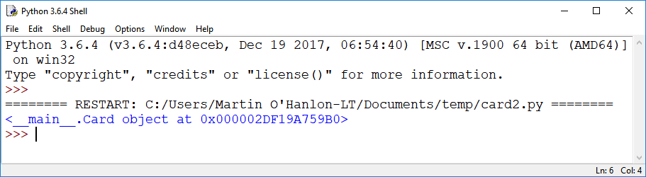
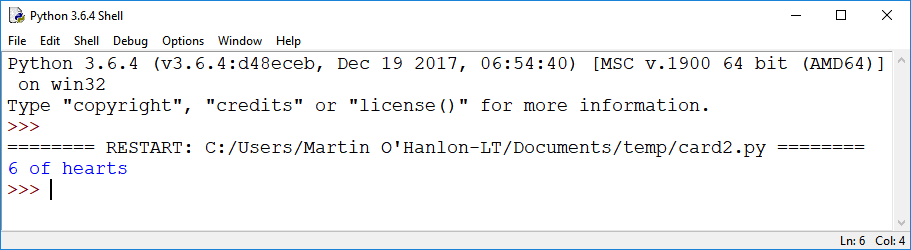

## ऑब्जेक्ट(object) बनाये

<video width="768" height="576" controls>
<source src="resources/clip2.mp4" type="video/mp4">
आपका ब्राउज़र वीडियो का समर्थन नहीं करता है, FireFox या Chrome आज़माएँ
</video>

card ऑब्जेक्ट(object) बनाकर हमारे `Card` क्लास(class) का परीक्षण करें। ऑब्जेक्ट(object) एक **उदाहरण(instance)**  है `Card` क्लास(class) का, और इसे बनाने को **इन्स्तांत(instantiating)** करना भी कहा जाता है।

+ अपनी क्लास(class) की परिभाषा के नीचे, `my_card` नामक एक card ऑब्जेक्ट(card) को पान की छक्की(6 of Hearts) के लिए लिखें:

```python
my_card = Card("hearts", "6")
```

आप सोच रहे होंगे कि कार्ड नंबर `"6"क्यों है ` (एक स्ट्रिंग(string)) और (पूर्णांक) नहीं `6` । ऐसा इसलिए है क्योंकि कार्ड के कुछ "नंबर" अक्षर होंगे: `"J"`, `"Q"`, `"K"`, और `"A"` ।

+ कार्ड ऑब्जेक्ट(object) दिखाने के लिए एक प्रिंट स्टेटमेंट(print statement) जोड़ें।

```python
print(my_card)
```

+ प्रोग्राम Run करें |

आप शायद `"पान(hearts)"`और `"6"` वाले आउटपुट को देखने की उम्मीद कर रहे हैं । इसके बजाय आप जो देखेंगे वह आपके ऑब्जेक्ट(object) का टेक्स्ट(text) **प्रतिनिधित्व** है - यह एक `Card` ऑब्जेक्ट(object) है, और आपको इसका पता(address) आपके कंप्यूटर की मेमोरी(memory) में दिखाया गया है:



यह आउटपुट(output) एक विशेष विधि(method) द्वारा बनाया गया है जिसे `__repr__`कहा जाता है (जो 'प्रतिनिधित्व' के लिए संक्षिप्त है)। Python के सभी ऑब्जेक्ट(object) में व्यतिक्रम रूप से यह विधि(method) है, जिसका अर्थ है कि आपको `__repr__` स्वयं बनाने की आवश्यकता नहीं है । जब भी आप अपने कार्यक्रम को किसी ऑब्जेक्ट(object) का टेक्स्ट(text) प्रतिनिधित्व वापस(return) करने के लिए कहेंगे तो यह स्वचालित रूप से उपयोग किया जाएगा। हालाँकि, यह बदलने के लिए कि आपकी ऑब्जेक्ट(object) को टेक्स्ट(text) के रूप में कैसे दर्शाया गया है, आप `__repr__`विधि(method) का डिफ़ॉल्ट(default) आउटपुट(output) **ओवरराइड(override)** कर सकते हैं।

+ अपने `Card` क्लास(class) की परिभाषा पर वापस जाएं और `__repr__` विधि(method) को ओवरराइड(override) करने के लिए कुछ कोड में जोड़ें ताकि यह अधिक सार्थक तरीके से कार्ड का वर्णन करे:

```python
def __repr__(self):
    return self.number + " of " + self.suit
```

उदाहरण के लिए, यदि `self.number` है `"5"` और `self.suit` है `"spades"`, यह "5 of spades" प्रिंट करेगा।

+ प्रोग्राम(program) को फिर से Run करें और जांचें कि ऑब्जेक्ट(object) का प्रतिनिधित्व करने का आपका नया तरीका टेक्स्ट(text) काम करता है, जैसे



आप इस प्रतिनिधित्व को अपनी पसंद के अनुसार बदल भी कर सकते हैं।

