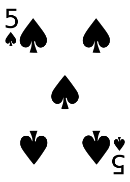

## Creëer een class (klasse)

Een **class (klasse)** is als een sjabloon voor het maken van objecten. Beschouw een class als een uitsteekvorm voor koekjes — het is een sjabloon voor alle koekjes die je maakt. Je kunt net zo veel koekjes (objecten) maken als je wilt, en ze beginnen allemaal met hetzelfde sjabloon. 

<video width="768" height="576" controls>
<source src="resources/Cementyourknowledgeofobjects_sd.mp4" type="video/mp4">
Je browser ondersteunt de videotag niet, dus probeer Firefox of Chrome.
</video>

Wanneer je echte koekjes maakt, maak je ze met dezelfde uitsteekvorm, maar je kunt elk individueel koekje aanpassen, bijvoorbeeld door wat glazuur of wat hagelslag toe te voegen. Hetzelfde geldt voor objecten die met een class zijn gemaakt — je kunt elk object aanpassen door er verschillende gegevens in op te slaan. Laten we eens kijken hoe dit in de praktijk werkt.

### Creëer een class

Je gaat beginnen met het maken van een class `Kaart` die zal fungeren als een sjabloon voor het maken van speelkaartobjecten.

Elk kaartobject vertegenwoordigt een aparte **instantie** van de `Kaart` class. Je kunt bijvoorbeeld een kaartobject hebben dat de schoppen 5 vertegenwoordigt en een ander kaartobject dat de harten 2 vertegenwoordigt.

Onze speelkaarten worden weergegeven als tekst in plaats van als afbeeldingen zoals hieronder.



Je kunt kiezen of je de video wilt bekijken of de schriftelijke instructies wilt gebruiken.

<video width="768" height="576" controls>
<source src="resources/clip1.mp4" type="video/mp4">
Je browser ondersteunt de videotag niet, dus probeer Firefox of Chrome.
</video>

+ Open een nieuw Python-bestand en sla het op als `card.py`.

+ Begin met het maken van een klasse `Kaart`:

```python
class Kaart:
```

Classnamen worden meestal met een hoofdletter geschreven, zodat ze gemakkelijk kunnen worden onderscheiden van variabelenamen.

Vervolgens ga je een **methode** aan de class toevoegen. Methoden lijken erg op functies en we gebruiken ze om te communiceren met objecten.

### Methoden

Mogelijk ben je al functies tegengekomen bij het schrijven van Python-code. Met functies kunnen we een reeks instructies een naam geven. Je kunt gegevens doorgeven aan een functie als parameters, en optioneel kunt je de functie enkele gegevens laten retourneren.

Het verschil tussen een functie en een methode is dat de methode wordt aangeroepen **op een object**. Dit betekent dat een methode alle in het object opgeslagen gegevens kan gebruiken, evenals alle gegevens die je eraan meegeeft als parameters.

### Maak een `__init__` methode

In Python heeft elke klasse een speciale methode genaamd `__init__` die vertelt hoe een object moet worden gemaakt (of **geïnitialiseerd**). Deze specifieke methodenaam heeft altijd een dubbel onderstrepingsteken aan weerszijden van `init`.

+ Maak een `__init__` methode in je `Kaart` class:

```python
class Kaart:
    def __init__(self):
```

--- collapse ---
---
title: Waarom heb ik de `self` tussen haakjes nodig?
---

Een methode heeft context nodig om te werken. `self` is de verwijzing naar het object en dit moet de eerste parameter zijn die wordt doorgegeven aan een methode van `Class`. Dit komt omdat de methode moet weten waarop deze wordt aangeroepen, zodat deze de gegevens kan gebruiken die in het object zijn opgeslagen.

Laten we een voorbeeld bekijken:

Buiten OOP moet een variabele global (globaal) zijn als twee functies deze variabele willen delen:

```python
naam = "Laura"

def hoi():
    print("Hoi" + naam)

def dag():
    print("Dag" + naam)
```

Binnen een class kan `self` worden gebruikt om variabelen te delen.

```python
class Welkom():
    def __init__(self):
        self.naam = "Laura"

    def hoi(self):
        print("Hoi" + self.naam)

    def dag(self):
        print("Dag"+ self.naam)
```

Hier hebben we de variabele `self.naam` gedefinieerd en de waarde ingesteld op `"Laura"` binnen de methode `__init__` die het object van deze class initialiseert. Alle objecten bevatten dus een variabele `self.naam` ingesteld op `"Laura"`. De methoden `hoi()` en `dag()` die we hebben gedefinieerd, kunnen nu de informatie gebruiken die is opgeslagen in `self.naam`.

--- /collapse ---

### Attributen

Attributen (eigenschappen) zijn stukjes informatie die binnen een object zijn opgeslagen, zoals een verzameling variabelen die aan dat object zijn gekoppeld. Het kaartobject begint met twee attributen, `kleur` en `nummer`, en we zullen ze vooraf laten gaan door `self.` om aan te geven dat ze tot de objectinstantie behoren.

+ Voeg twee attributen toe aan je `__init__` methode en twee parameters zodat je hun waarden als argumenten kunt doorgeven wanneer je het object maakt:

```python
def __init__(self, kleur, nummer):
    self.kleur = kleur
    self.nummer = nummer
```
