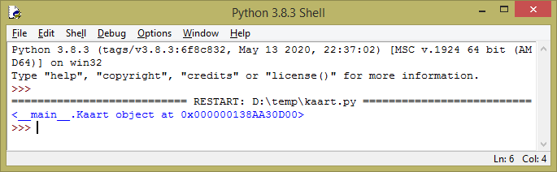
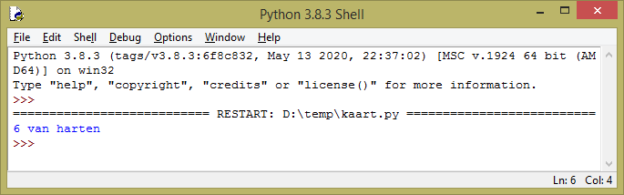

## Een object instantiëren

<video width="768" height="576" controls>
<source src="resources/clip2.mp4" type="video/mp4">
Je browser ondersteunt de videotag niet, dus probeer Firefox of Chrome.
</video>

Laten we onze class `Kaart` testen door een kaartobject te maken. Het object is een **instantie** van de class `Kaart` en het maken ervan wordt ook **instantiëren** genoemd.

+ Onder je classdefinitie, instantieer een kaartobject met de naam `mijn_kaart` voor de harten 6:

```python
mijn_kaart = Kaart("harten", "6")
```

Je vraagt je misschien af waarom het kaartnummer `"6"` (een string) is en niet `6` (een geheel getal). Dit komt omdat sommige van de "kaartnummers" letters zijn: `"B"`, `"V"`, `"H"`en `"A"`.

+ Voeg een printopdracht toe om het kaartobject weer te geven.

```python
print(mijn_kaart)
```

+ Voer het programma uit.

Je verwacht waarschijnlijk een uitvoer met `"harten"` en `"6"`. In plaats daarvan zie je de tekst-**representatie** van je object — het is een `Kaart` object en je krijgt het adres in het geheugen van je computer te zien:



Deze uitvoer wordt gemaakt door een speciale methode genaamd `__repr__` (wat staat voor 'representatie'). Alle objecten in Python hebben standaard deze methode, wat betekent dat je niet zelf `__repr__` hoeft aan te maken. Het wordt automatisch gebruikt wanneer je je programma vertelt een tekstweergave van een object te retourneren. Je kunt echter een **override (overschrijven)** doen van de standaard uitvoer van de `__repr__` methode om te veranderen hoe je object wordt weergegeven als tekst.

+ Ga terug naar de definitie van je `Kaart` class en voeg wat code toe om de methode `__repr__` te overschrijven zodat deze de kaart op een meer betekenisvolle manier beschrijft:

```python
def __repr__(self):
    return self.nummer + "van" + self.kleur
```

Als bijvoorbeeld `self.nummer` `"5"` is en `self.kleur` is `"schoppen"`, dan wordt "5 van schoppen" afgedrukt.

+ Voer het programma opnieuw uit en controleer of je nieuwe manier om het object als tekst weer te geven werkt, bijvoorbeeld



Je kunt deze weergave ook naar eigen wens aanpassen.

